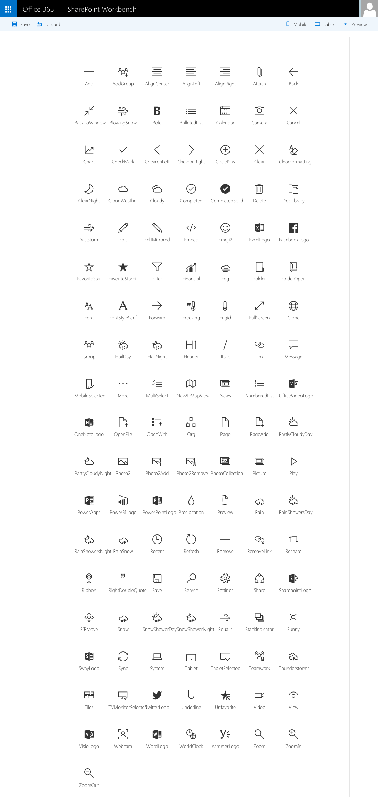

# Icon Font Names Web Part

Shows list of icons supported by SharePoint Framework Client-Side Web Parts.

Here is the list of icons that you can use with the **officeFabricIconFontName** property in the manifest of Client-Side Web Parts:

- Add
- AddGroup
- AlignCenter
- AlignLeft
- AlignRight
- Attach
- Back
- BackToWindow
- BlowingSnow
- Bold
- BulletedList
- Calendar
- Camera
- Cancel
- Chart
- CheckMark
- ChevronLeft
- ChevronRight
- CirclePlus
- Clear
- ClearFormatting
- ClearNight
- CloudWeather
- Cloudy
- Completed
- CompletedSolid
- Delete
- DocLibrary
- Duststorm
- Edit
- EditMirrored
- Embed
- Emoji2
- ExcelLogo
- FacebookLogo
- FavoriteStar
- FavoriteStarFill
- Filter
- Financial
- Fog
- Folder
- FolderOpen
- Font
- FontStyleSerif
- Forward
- Freezing
- Frigid
- FullScreen
- Globe
- Group
- HailDay
- HailNight
- Header
- Italic
- Link
- Message
- MobileSelected
- More
- MultiSelect
- Nav2DMapView
- News
- NumberedList
- OfficeVideoLogo
- OneNoteLogo
- OpenFile
- OpenWith
- Org
- Page
- PageAdd
- PartlyCloudyDay
- PartlyCloudyNight
- Photo2
- Photo2Add
- Photo2Remove
- PhotoCollection
- Picture
- Play
- PowerApps
- PowerBILogo
- PowerPointLogo
- Precipitation
- Preview
- Rain
- RainShowersDay
- RainShowersNight
- RainSnow
- Recent
- Refresh
- Remove
- RemoveLink
- Reshare
- Ribbon
- RightDoubleQuote
- Save
- Search
- Settings
- Share
- SharepointLogo
- SIPMove
- Snow
- SnowShowerDay
- SnowShowerNight
- Squalls
- StackIndicator
- Sunny
- SwayLogo
- Sync
- System
- Tablet
- TabletSelected
- Teamwork
- Thunderstorms
- Tiles
- TVMonitorSelected
- TwitterLogo
- Underline
- Unfavorite
- Video
- View
- VisioLogo
- Webcam
- WordLogo
- WorldClock
- YammerLogo
- Zoom
- ZoomIn
- ZoomOut

## Running this Web Part

- clone this repo
- `$ npm i`
- `$ gulp serve`